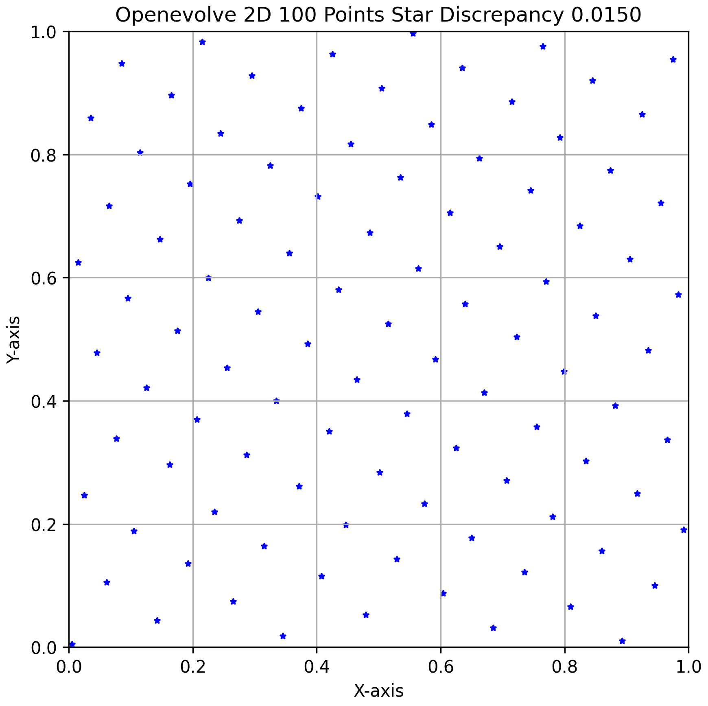

## Star Discrepancy
Star discrepancy (often denoted D* or D*_N) is a quantitative measure of the uniformity of a set of N points within the d-dimensional unit hypercube [0,1]^d. It essentially gauges how evenly the points are spread out. A lower star discrepancy value indicates a more uniform distribution of points.

**How is it calculated?**
The star discrepancy is defined as the largest difference between the volume of any d-dimensional "anchor box" (a hyperrectangle with one corner at the origin (0,...,0) and the opposite corner at x = (x_1,...,x_d) within the unit hypercube) and the proportion of points from the set that fall inside that anchor box. Mathematically, for a point set {X_i} for i=1 to N:

D*({X_i}) = sup_{x ∈ [0,1]^d} | (#({X_i} ∩ [0,x)) / N - μ([0,x)) |

where:
*   `sup` is the supremum (least upper bound) taken over all possible anchor boxes [0,x).
*   `#({X_i} ∩ [0,x))` is the count of points from the set {X_i} that fall within the anchor box [0,x).
*   `N` is the total number of points in the set.
*   `μ([0,x))` is the Lebesgue measure (i.e., volume) of the anchor box [0,x).

**Why does it matter?**
Star discrepancy is a fundamental concept in quasi-Monte Carlo (QMC) methods. QMC methods use deterministic low-discrepancy point sets instead of random points for numerical integration and other applications. The Koksma-Hlawka inequality provides a theoretical bound on the error of QMC integration, showing that the integration error is proportional to the star discrepancy of the point set used. Therefore, point sets with lower star discrepancy generally lead to:
*   More accurate approximations in numerical integration.
*   Faster convergence rates compared to standard Monte Carlo methods that use random points.
*   Improved efficiency in various fields like financial modeling, computer graphics, and scientific simulation where uniform sampling is crucial.

Finding point sets with the smallest possible star discrepancy for a given N and d is a challenging but important problem.

## Comparison to Known Optimal Point Sets

This presents a comparison of star-discrepancy values for point sets in 2 dimensions ([0,1]²) generated by different methods, where the optimal arrangement is known:
*   **Fibonacci:** Based on the Fibonacci lattice.
*   **MPMC:** Message-Passing Monte Carlo via GNN (https://arxiv.org/abs/2405.15059v2).
*   **OpenEvolve:** Values provided from an evolutionary optimization process via LLMs.
*   **Optimal:** Known optimal star-discrepancy values (https://arxiv.org/abs/2311.17463) from Clement et al.

The values are for 2D point sets for N points, where N ranges from 1 to 20. Openevolve matches the optimal star discrepancy for N < 11.

| N  | Fibonacci | MPMC   | OpenEvolve | Optimal |
|----|-----------|--------|------------|---------|
| 1  | 1.0000    | 0.6180 | 0.6180     | 0.6180  |
| 2  | 0.6909    | 0.3660 | 0.3660     | 0.3660  |
| 3  | 0.5880    | 0.2847 | 0.2847     | 0.2847  |
| 4  | 0.4910    | 0.2500 | 0.2500     | 0.2500  |
| 5  | 0.3528    | 0.2000 | 0.2000     | 0.2000  |
| 6  | 0.3183    | 0.1692 | 0.1667     | 0.1667  |
| 7  | 0.2728    | 0.1508 | 0.1500     | 0.1500  |
| 8  | 0.2553    | 0.1354 | 0.1328     | 0.1328  |
| 9  | 0.2270    | 0.1240 | 0.1235     | 0.1235  |
| 10 | 0.2042    | 0.1124 | 0.1111     | 0.1111  |
| 11 | 0.1857    | 0.1058 | 0.1039     | 0.1030  |
| 12 | 0.1702    | 0.0975 | 0.0960     | 0.0952  |
| 13 | 0.1571    | 0.0908 | 0.0892     | 0.0889  |
| 14 | 0.1459    | 0.0853 | 0.0844     | 0.0837  |
| 15 | 0.1390    | 0.0794 | 0.0791     | 0.0782  |
| 16 | 0.1486    | 0.0768 | 0.0745     | 0.0739  |
| 17 | 0.1398    | 0.0731 | 0.0712     | 0.0699  |
| 18 | 0.1320    | 0.0699 | 0.0676     | 0.0666  |
| 19 | 0.1251    | 0.0668 | 0.0654     | 0.0634  |
| 20 | 0.1188    | 0.0640 | 0.0611     | 0.0604  |


## Discovery of Better Point Sets
We find point sets with lower star discrepancy than the current known best in 2D for N > 30.
See the results folder for the point sets we obtain using openevolve.

| N   | Fibonacci | Clément et al. | MPMC    | Openevolve |
|-----|-----------|----------------|---------|------------|
| 30  | 0.07923   | 0.04240        | N/A     | 0.04380    |
| 40  | 0.06384   | 0.03320        | N/A     | 0.03313    |
| 50  | 0.05307   | 0.02800        | N/A     | 0.02784    |
| 60  | 0.04422   | 0.02435        | 0.02729 | 0.02336    |
| 100 | 0.02749   | 0.01933        | 0.01879 | 0.01504    |

# Example 2D Point Set Construction for 100 points using Openevolve



| N    | Sobol   | Fibonacci | MPMC    | Openevolve |
|------|---------|-----------|---------|------------|
| 140  | 0.03306 | 0.02128   | 0.01373 | 0.01151    |
| 180  | 0.02466 | 0.01655   | 0.01147 | 0.01058    |
| 220  | 0.02420 | 0.01354   | 0.00975 | 0.00891    |
| 260  | 0.02571 | 0.01200   | 0.00843 | 0.00831    |
| 300  | 0.01851 | 0.01054   | 0.00752 | 0.00741    |
| 340  | 0.01280 | 0.00957   | 0.00710 | 0.00696    |
| 380  | 0.01442 | 0.00857   | 0.00695 | 0.00638    |
| 420  | 0.01326 | 0.00775   | 0.00584 | 0.00563    |
| 460  | 0.01225 | 0.00708   | 0.00540 | 0.00471    |
| 500  | 0.01289 | 0.00651   | 0.00518 | 0.00509    |
| 540  | 0.00967 | 0.00603   | 0.00488 | 0.00407    |
| 580  | 0.00967 | 0.00561   | 0.00476 | 0.00377    |
| 620  | 0.00977 | 0.00525   | 0.00454 | 0.00386    |
| 660  | 0.01064 | 0.00509   | 0.00437 | 0.00360    |
| 700  | 0.00724 | 0.00480   | 0.00416 | 0.00379    |
| 740  | 0.00765 | 0.00484   | 0.00397 | 0.00346    |
| 780  | 0.00697 | 0.00459   | 0.00376 | 0.00310    |
| 820  | 0.00691 | 0.00436   | 0.00360 | 0.00294    |
| 860  | 0.00772 | 0.00416   | 0.00356 | 0.00316    |
| 900  | 0.00638 | 0.00398   | 0.00319 | 0.00296    |
| 940  | 0.00637 | 0.00381   | 0.00321 | 0.00289    |
| 980  | 0.00640 | 0.00365   | 0.00308 | 0.00280    |
| 1020 | 0.00616 | 0.00351   | 0.00303 | 0.00245    |

## Future Work
This work is limited by:
1. The need to optimize point sets for each N and D
2. The need for repeated sampling to generate low discrepancy sequences 
2. Difficulty scaling to higher N and D

# OpenEvolve

An open-source implementation of the AlphaEvolve system described in the Google DeepMind paper "AlphaEvolve: A coding agent for scientific and algorithmic discovery" (2025).


## Overview

OpenEvolve is an evolutionary coding agent that uses Large Language Models to optimize code through an iterative process. It orchestrates a pipeline of LLM-based code generation, evaluation, and selection to continuously improve programs for a variety of tasks.

Key features:
- Evolution of entire code files, not just single functions
- Support for multiple programming languages
- Supports OpenAI-compatible APIs for any LLM
- Multi-objective optimization
- Flexible prompt engineering
- Distributed evaluation


## How It Works

OpenEvolve follows an evolutionary approach with the following components:


1. **Prompt Sampler**: Creates context-rich prompts containing past programs, their scores, and problem descriptions
2. **LLM Ensemble**: Generates code modifications via an ensemble of language models
3. **Evaluator Pool**: Tests generated programs and assigns scores
4. **Program Database**: Stores programs and their evaluation metrics, guiding future evolution

The controller orchestrates interactions between these components in an asynchronous pipeline, maximizing throughput to evaluate as many candidate solutions as possible.

## Getting Started

### Installation

To install natively, use:
```bash
git clone https://github.com/codelion/openevolve.git
cd openevolve
pip install -e .
```

### Quick Start

We use the OpenAI SDK, so you can use any LLM or provider that supports an OpenAI compatible API. Just set the `OPENAI_API_KEY` environment variable
and update the `api_base` in config.yaml if you are using a provider other than OpenAI. For local models, you can use
an inference server like [optillm](https://github.com/codelion/optillm).

```python
from openevolve import OpenEvolve

# Initialize the system
evolve = OpenEvolve(
    initial_program_path="path/to/initial_program.py",
    evaluation_file="path/to/evaluator.py",
    config_path="path/to/config.yaml"
)

# Run the evolution
best_program = await evolve.run(iterations=1000)
print(f"Best program metrics:")
for name, value in best_program.metrics.items():
    print(f"  {name}: {value:.4f}")
```

### Command-Line Usage

OpenEvolve can also be run from the command line:

```bash
python openevolve-run.py path/to/initial_program.py path/to/evaluator.py --config path/to/config.yaml --iterations 1000
```

### Resuming from Checkpoints

OpenEvolve automatically saves checkpoints at intervals specified by the `checkpoint_interval` config parameter (default is 10 iterations). You can resume an evolution run from a saved checkpoint:

```bash
python openevolve-run.py path/to/initial_program.py path/to/evaluator.py \
  --config path/to/config.yaml \
  --checkpoint path/to/checkpoint_directory \
  --iterations 50
```

When resuming from a checkpoint:
- The system loads all previously evolved programs and their metrics
- Checkpoint numbering continues from where it left off (e.g., if loaded from checkpoint_50, the next checkpoint will be checkpoint_60)
- All evolution state is preserved (best programs, feature maps, archives, etc.)
- Each checkpoint directory contains a copy of the best program at that point in time

Example workflow with checkpoints:

```bash
# Run for 50 iterations (creates checkpoints at iterations 10, 20, 30, 40, 50)
python openevolve-run.py examples/function_minimization/initial_program.py \
  examples/function_minimization/evaluator.py \
  --iterations 50

# Resume from checkpoint 50 for another 50 iterations (creates checkpoints at 60, 70, 80, 90, 100)
python openevolve-run.py examples/function_minimization/initial_program.py \
  examples/function_minimization/evaluator.py \
  --checkpoint examples/function_minimization/openevolve_output/checkpoints/checkpoint_50 \
  --iterations 50
```

### Comparing Results Across Checkpoints

Each checkpoint directory contains the best program found up to that point, making it easy to compare solutions over time:

```
checkpoints/
  checkpoint_10/
    best_program.py         # Best program at iteration 10
    best_program_info.json  # Metrics and details
    programs/               # All programs evaluated so far
    metadata.json           # Database state
  checkpoint_20/
    best_program.py         # Best program at iteration 20
    ...
```

You can compare the evolution of solutions by examining the best programs at different checkpoints:

```bash
# Compare best programs at different checkpoints
diff -u checkpoints/checkpoint_10/best_program.py checkpoints/checkpoint_20/best_program.py

# Compare metrics
cat checkpoints/checkpoint_*/best_program_info.json | grep -A 10 metrics
```
### Docker

You can also install and execute via Docker:
```bash
docker build -t openevolve .
docker run --rm -v $(pwd):/app --network="host" openevolve examples/function_minimization/initial_program.py examples/function_minimization/evaluator.py --config examples/function_minimization/config.yaml --iterations 1000
```

## Configuration

OpenEvolve is highly configurable. You can specify configuration options in a YAML file:

```yaml
# Example configuration
max_iterations: 1000
llm:
  primary_model: "gemini-2.0-flash-lite"
  secondary_model: "gemini-2.0-flash"
  temperature: 0.7
database:
  population_size: 500
  num_islands: 5
```

Sample configuration files are available in the `configs/` directory:
- `default_config.yaml`: Comprehensive configuration with all available options

See the [Configuration Guide](configs/default_config.yaml) for a full list of options.

## Examples

See the `examples/` directory for complete examples of using OpenEvolve on various problems:

### Symbolic Regression

A comprehensive example demonstrating OpenEvolve's application to symbolic regression tasks using the LLM-SRBench benchmark. This example shows how OpenEvolve can evolve simple mathematical expressions (like linear models) into complex symbolic formulas that accurately fit scientific datasets.

[Explore the Symbolic Regression Example](examples/symbolic_regression/)

Key features:
- Automatic generation of initial programs from benchmark tasks
- Evolution from simple linear models to complex mathematical expressions
- Evaluation on physics, chemistry, biology, and material science datasets
- Competitive results compared to state-of-the-art symbolic regression methods

### Circle Packing

Our implementation of the circle packing problem from the AlphaEvolve paper. For the n=26 case, where one needs to pack 26 circles in a unit square we also obtain SOTA results.

[Explore the Circle Packing Example](examples/circle_packing/)

We have sucessfully replicated the results from the AlphaEvolve paper, below is the packing found by OpenEvolve after 800 iterations


This is exactly the packing reported by AlphaEvolve in their paper (Figure 14):


### Function Minimization

An example showing how OpenEvolve can transform a simple random search algorithm into a sophisticated simulated annealing approach.

[Explore the Function Minimization Example](examples/function_minimization/)

## Preparing Your Own Problems

To use OpenEvolve for your own problems:

1. **Mark code sections** to evolve with `# EVOLVE-BLOCK-START` and `# EVOLVE-BLOCK-END` comments
2. **Create an evaluation function** that returns a dictionary of metrics
3. **Configure OpenEvolve** with appropriate parameters
4. **Run the evolution** process

## Citation

If you use OpenEvolve in your research, please cite:

```
@software{openevolve,
  title = {OpenEvolve: Open-source implementation of AlphaEvolve},
  author = {Asankhaya Sharma},
  year = {2025},
  publisher = {GitHub},
  url = {https://github.com/codelion/openevolve}
}
```
