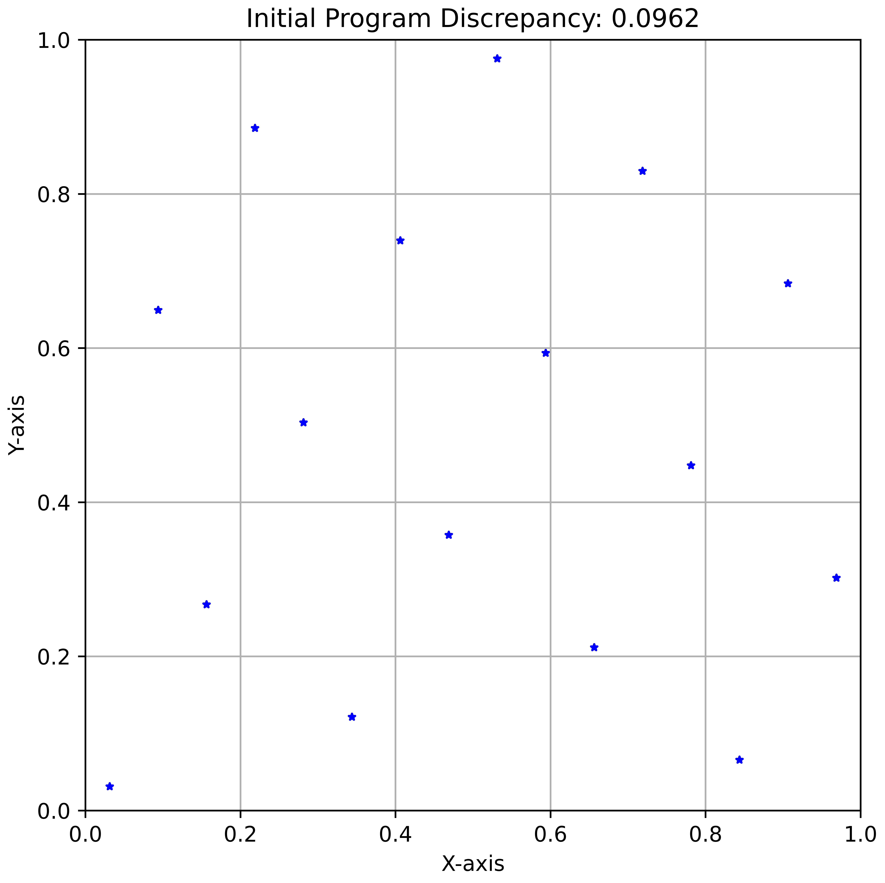
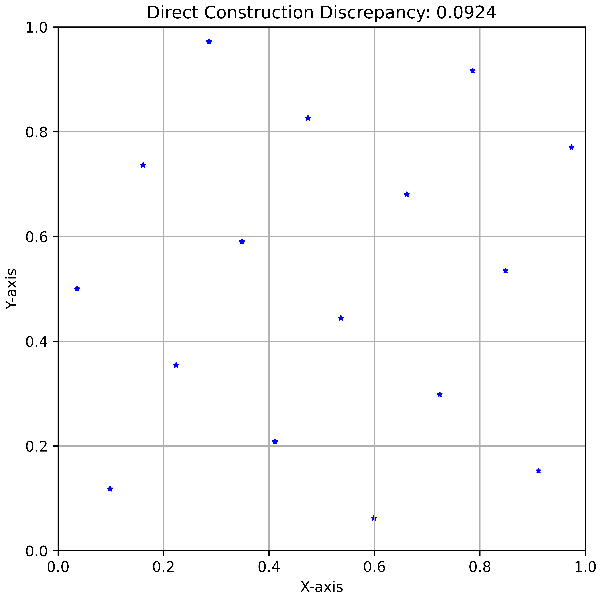
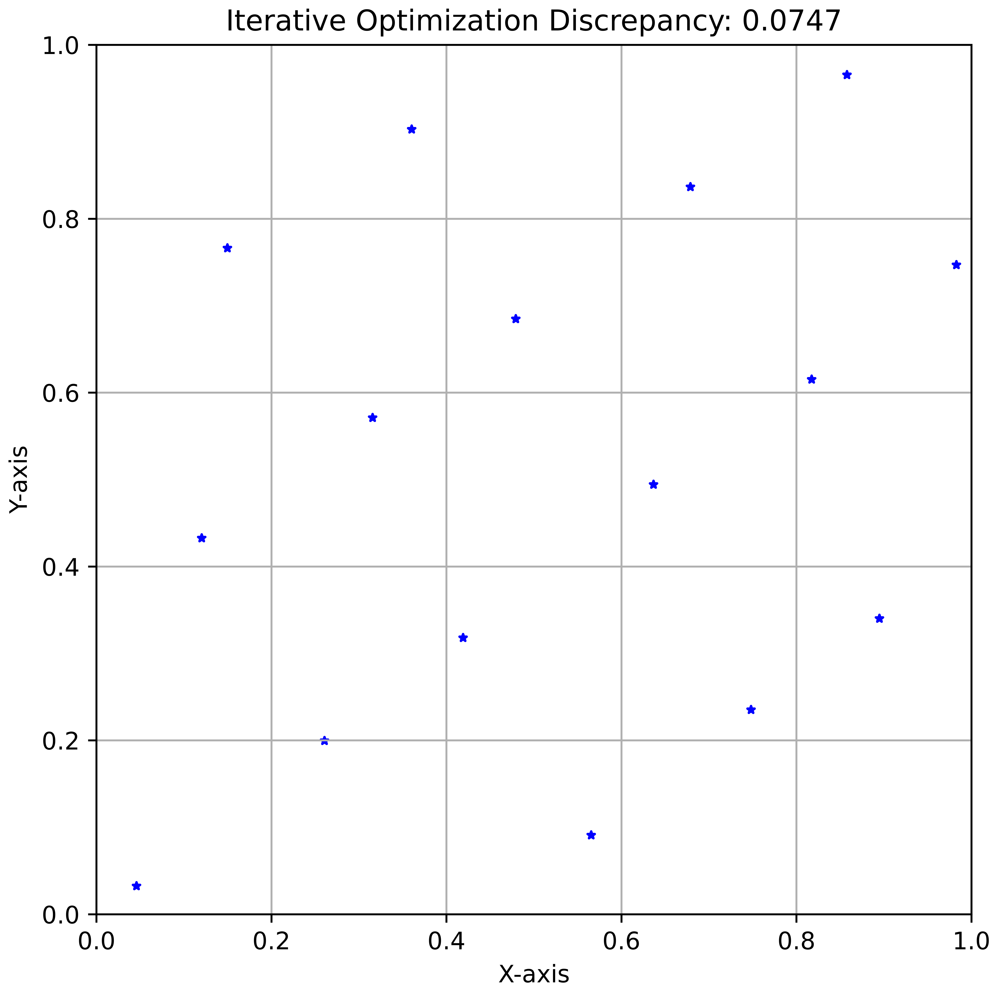

# Star Discrepancy Example

This example demonstrates how OpenEvolve can be used to tackle the challenging mathematical problem of generating low discrepancy point sets. Specifically, we focus on generating 2D point sets with optimal star discrepancy. This is a fundamental problem in quasi-Monte Carlo methods, numerical integration, computer graphics, and various simulation tasks.
## Problem Overview

We focus on placing N points to minimize star discrepancy
- All points must lie within the unit square
- The star discrepancy of a finite point set measures the worst
absolute difference between the Lebesgue measure of a d-dimensional box 
anchored at the origin and the proportion of points that fall inside this box. 

According to the Clement et al. paper, a solution with a star discrepnacy of 0.0739 is optimal. Our goal was to match this result.

## Our Approach

We structured our evolution in two phases, the first consisting solely of direction construction and the second consisting of optimization routines.

### Phase 1: Direct Construction

In the first phase, we focused on exploring different constructions. 
We set our initial program to be a shifted Fibonacci Sequence (discrepancy of 0.0962).

```python
# Initial attempt
N = 16
A = np.zeros((N, 2))
golden_ratio = (math.sqrt(5) - 1) / 2  # Approximation of the golden ratio
# Use stratified sampling for x-coordinates
for i in range(N):
    A[i, 0] = (i + 0.5) / N  # Stratified sampling in x
    # Use a modified golden ratio for y-coordinates, shifted and scaled
    A[i, 1] = ((i * golden_ratio) % 1 + (0.5 / N)) % 1 # Golden ratio for y-coordinates, shifted.
return A
```




We let this direct construction approach run for 1000 iterations for exhaustive search. 
This optimal direct constuction was found after 243 iterations (discrepancy of 0.0924)

```python
N = 16
A = np.zeros((N, 2))
for i in range(N):
    A[i, 0] = (i + (1/math.sqrt(3))) / N  # Adjusted x-coordinates for better distribution
    A[i, 1] = ((0.5 + (i * 0.61803398875) % 1)) % 1 # Inverse golden ratio * i, ensuring values within [0, 1]

return A
```


### Phase 2: Iterative Optimation

After searching over direct constructions, we changed the prompt to instead have the LLM code iterative optimization routines to find the optimal point set for an additional 1500 iterations. We found this implentation, found after 1116 iterations (after the initial 1000) to be optimal. We obtain a final star discrepancy value of 0.0744 which is within 0.68% of the optimal solution found by Clement et al. (discrepancy: 0.0739).

```python
N = 16
    
# Initial guess: Optimized Latin hypercube sampling with a different approach
initial_points = np.zeros((N, 2))
for i in range(N):
    initial_points[i, 0] = (i + np.random.rand()) / N  # Jittered within each interval
    initial_points[i, 1] = ((i * 0.38196601125) % 1) + np.random.rand()/(2*N) # Golden ratio with jitter

def discrepancy_wrapper(x):
    points = x.reshape(N, 2)
    return star_discrepancy(points)

# Flatten the initial points for the optimizer
x0 = initial_points.flatten()

# Define bounds for each coordinate (0 <= x, y <= 1)
bounds = [(0.0, 1.0)] * (N * 2)

# Use SLSQP optimizer with more robust parameters. Increased iterations and tightened tolerance.
# Try different initial values and restarts for robustness
best_result = None
best_discrepancy = float('inf')

for _ in range(25):  # Multiple restarts
    x0_restart = initial_points.flatten() + np.random.normal(0, 0.01, N * 2)  # Jittered initial guess
    x0_restart = np.clip(x0_restart, 0.0, 1.0)

    result = minimize(discrepancy_wrapper, x0_restart, method='SLSQP', bounds=bounds,
                        options={'maxiter': 30000, 'ftol': 1e-15, 'iprint': 0}) # Increased maxiter and tightened ftol

    discrepancy = discrepancy_wrapper(result.x)
    if discrepancy < best_discrepancy:
        best_discrepancy = discrepancy
        best_result = result

# Reshape the optimized result back into the point array
optimized_points = best_result.x.reshape(N, 2)

return optimized_points



```
We apply this technique to construct 2D and 3D point sets for various N.
To the best of our knowledge, we find 2D point sets for N > 20 with lower star discrepancy than current best point sets and extend 3D point construction to N=16.
See these in the results folder.